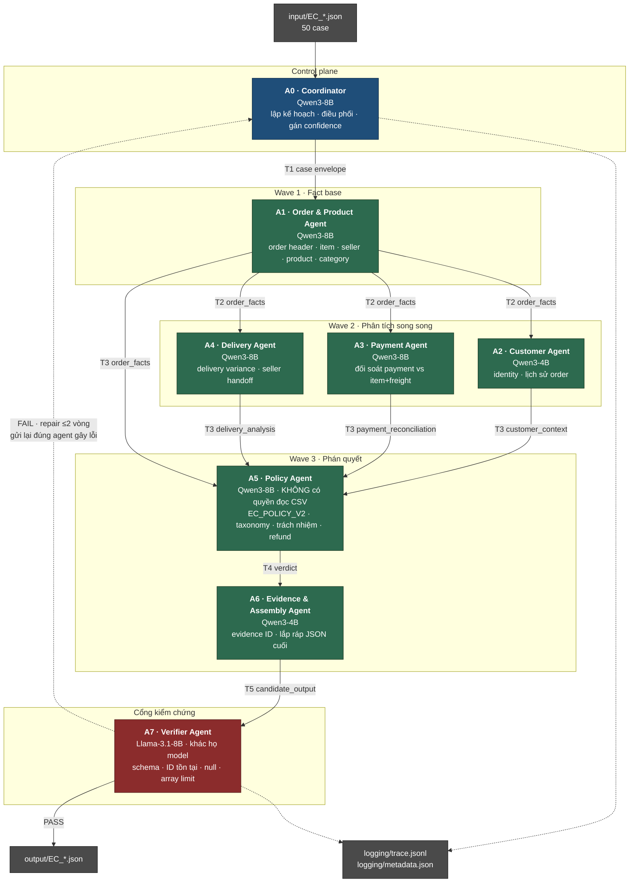
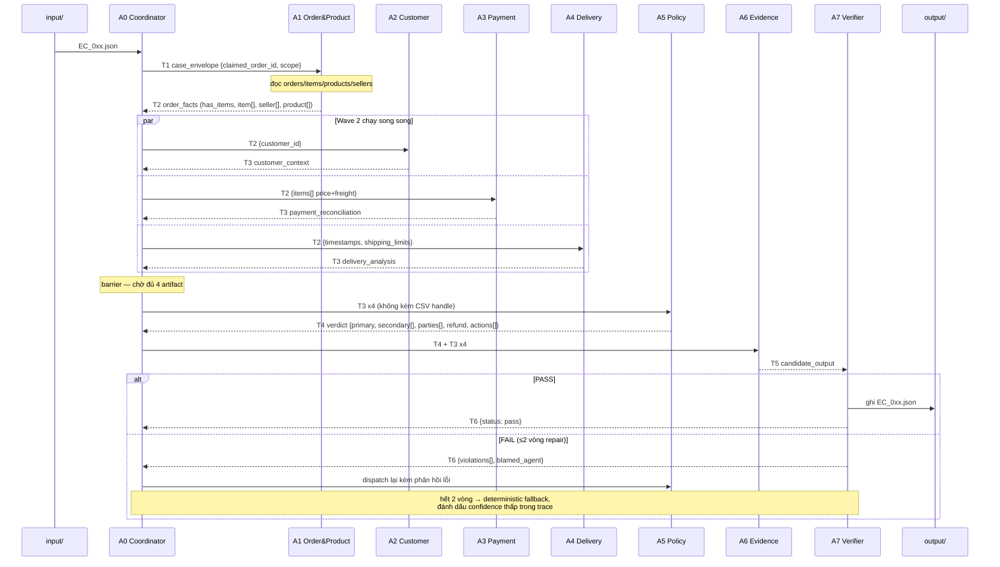

# Architecture — Multi-Agent E-commerce Dispute Resolution (EC_POLICY_V2)

Hệ thống điều tra 50 khiếu nại thương mại điện tử trên bộ dữ liệu Olist bằng một mạng
agent chuyên trách, giao tiếp với nhau qua các envelope A2A có kiểu (typed handoff), và
kết thúc bằng một cổng kiểm chứng bắt buộc trước khi ghi file `output/`.

---

## 1. Nguyên tắc thiết kế

Bốn nguyên tắc dưới đây quyết định toàn bộ phần còn lại của tài liệu.

**1.1. Agent quyết định, tool tính toán.**
Điểm số của bài lab được chấm trên số liệu chính xác tuyệt đối (`delivery_variance_hours`
đến 2 chữ số thập phân, `difference_brl`, danh sách ID). Model ≤10B không đáng tin khi làm
số học nhiều bước hay chép lại chuỗi hash 32 ký tự. Vì vậy mọi phép cộng tiền, trừ
timestamp và tra cứu ID đều nằm trong tool Python tất định; LLM chịu trách nhiệm phần mà
model thật sự giỏi: chọn tool nào, diễn giải kết quả, phân loại theo taxonomy, xử lý
trường hợp dữ liệu thiếu, và phán quyết theo thứ tự ưu tiên của policy. Đây là lý do một
model 8B đủ dùng cho bài toán này.

**1.2. Least privilege trên tầng dữ liệu.**
Mỗi agent chỉ được cấp đúng các bảng CSV cần cho domain của nó. Agent nào không cần đọc
dữ liệu thì **không có quyền đọc dữ liệu**. Cụ thể, Policy Agent — agent ra phán quyết
cuối — không có bất kỳ handle CSV nào; nó chỉ nhìn thấy artifact do các agent khác bàn
giao. Ràng buộc này biến "không được bịa sự kiện" từ một câu trong prompt thành một bất
biến của hệ thống: agent không thể bịa số liệu mà nó không có đường truy cập tới.

**1.3. Handoff là hợp đồng, không phải hội thoại.**
Các agent không trao đổi văn xuôi. Mỗi lần bàn giao là một envelope JSON được validate
bằng Pydantic. Envelope sai schema bị từ chối ngay tại biên, kèm thông báo lỗi để agent
gửi tự sửa — lỗi không lan sang bước sau.

**1.4. Không có đường tắt tới `output/`.**
Chỉ Verifier Agent mới được cấp quyền ghi. Một bản JSON không qua được cổng kiểm chứng sẽ
quay lại đúng agent đã sinh ra trường lỗi, tối đa 2 vòng repair, rồi mới rơi xuống
deterministic fallback. Không agent nào khác chạm được vào `output/`.

---

## 2. Sơ đồ agent



Hình dạng của đồ thị phản ánh phụ thuộc dữ liệu thật, không phải sơ đồ tổ chức: A1 phải
chạy trước vì A2 cần `customer_id` từ order header, A3 cần `price`/`freight_value` theo
item, còn A4 cần `shipping_limit_date` theo từng seller. Sau khi A1 xong, ba agent A2/A3/A4
chạy song song vì chúng độc lập nhau.

---

## 3. Vai trò từng agent

### A0 · Coordinator Agent

| | |
| --- | --- |
| **Model** | Qwen3-8B (thinking mode ON) |
| **Nhận** | `input/EC_*.json` |
| **Bàn giao** | `T1 case_envelope` → A1; `T5` đã duyệt → ghi trace |
| **Quyền dữ liệu** | Không đọc CSV. Chỉ đọc `input/`, ghi `logging/` |

Quyết định thuộc về LLM: đọc `investigation_scope` để chốt agent nào cần chạy (khi
`include_customer_history=false` thì bỏ A2, `include_product_context=false` thì A1 rút gọn
phạm vi); phân giải trạng thái khi hai agent bàn giao kết quả mâu thuẫn; chọn agent nào
phải làm lại khi Verifier trả lỗi; và gán `confidence` theo rubric ở §7. Coordinator giữ
blackboard của case và là nơi duy nhất biết toàn bộ tiến trình.

### A1 · Order & Product Agent

| | |
| --- | --- |
| **Model** | Qwen3-8B |
| **Nhận** | `T1 case_envelope` (chỉ có `claimed_order_id` + scope) |
| **Bàn giao** | `T2/T3 order_facts` → A2, A3, A4, A5 |
| **Quyền dữ liệu** | `orders`, `order_items`, `products`, `sellers`, `category_translation` — read-only |

Dựng fact base gốc của case: order header (status + 4 timestamp), toàn bộ item row theo
thứ tự `order_item_id`, seller ID theo thứ tự xuất hiện lần đầu, product ID và category.
Đây là agent xử lý nhánh "order không có item row" — 6/50 case rơi vào tình huống này — và
đánh dấu cờ `has_items=false` để A3, A4, A5 biết phải trả `null` thay vì `0`. Agent quyết
định thứ tự và phép cắt (truncation) của các mảng khi chạm trần schema; tool chỉ trả dữ
liệu thô.

### A2 · Customer Agent

| | |
| --- | --- |
| **Model** | Qwen3-4B-Instruct |
| **Nhận** | `T2 order_facts.customer_id` |
| **Bàn giao** | `T3 customer_context` → A5 |
| **Quyền dữ liệu** | `customers`, `orders` (chỉ cột `order_id`, `customer_id`) — read-only |

Phân giải `customer_id → customer_unique_id`, rồi truy ngược ra các order khác của cùng
khách. Agent chốt hai thứ: cờ `repeat_customer` cho secondary issue, và danh sách
`related_order_ids` (tối đa 5). Ràng buộc quan trọng agent phải giữ: order lịch sử **không
bao giờ** được đưa vào `affected_entities` — chúng chỉ tồn tại trong `customer_context`.
Vai trò này dùng model 4B vì công việc là tra cứu có cấu trúc, không phải suy luận nhiều bước.

### A3 · Payment Agent

| | |
| --- | --- |
| **Model** | Qwen3-8B |
| **Nhận** | `T2 order_facts.items[]` (price, freight_value) |
| **Bàn giao** | `T3 payment_reconciliation` → A5 |
| **Quyền dữ liệu** | `order_payments` — read-only. **Không** có `order_items` |

Cắt quyền `order_items` ở đây là cố ý: A3 buộc phải lấy `item_total_brl` và
`freight_total_brl` từ artifact của A1, nên nếu A1 sai thì sai lệch lộ ra ở khâu đối soát
thay vì bị hai agent che lấp cho nhau. A3 tổng hợp payment row theo `payment_sequential`,
tính `difference_brl` và phán quyết `reconciled = abs(difference) <= 0.10`. Agent xử lý
biên `|difference|` đúng bằng 0.10 (kết luận: reconciled), phân biệt `null` với `0.0` khi
order không có item row, và giữ `payment_types` theo thứ tự sequential — 12/50 case có
nhiều loại payment nên thứ tự này ảnh hưởng điểm.

### A4 · Delivery Agent

| | |
| --- | --- |
| **Model** | Qwen3-8B |
| **Nhận** | `T2 order_facts` (timestamp + shipping_limit theo seller) |
| **Bàn giao** | `T3 delivery_analysis` → A5 |
| **Quyền dữ liệu** | `orders` (chỉ 4 cột timestamp) — read-only. **Không** có `order_items` |

Tính `delivery_variance_hours` và, cho từng seller, `handoff_variance_hours` so với
`shipping_limit_date` sớm nhất của seller đó, rồi kết luận `late_handoff`. Đây là agent
chịu tải null cao nhất: 14/50 case null `order_delivered_customer_date` và 13/50 null
`order_delivered_carrier_date`. Quy tắc agent phải áp: thiếu timestamp thì variance là
`null` và **không được suy ra là trễ** — thiếu bằng chứng không phải bằng chứng vi phạm.
Đây chính xác là loại phán đoán mà LLM làm tốt còn một biểu thức `if` viết vội hay làm sai.

### A5 · Policy Agent

| | |
| --- | --- |
| **Model** | Qwen3-8B (thinking mode ON) |
| **Nhận** | `T3` từ A1 + A2 + A3 + A4 (đủ 4 mới chạy) |
| **Bàn giao** | `T4 verdict` → A6 |
| **Quyền dữ liệu** | **Không có quyền đọc bất kỳ CSV nào** |

Agent quan trọng nhất và bị giới hạn quyền chặt nhất. Áp `EC_POLICY_V2` theo đúng thứ tự
ưu tiên để chốt `primary_issue`, chọn `secondary_issues` theo thứ tự nghiệp vụ 1→5, xác
định `responsible_parties`, xếp hạng `ranked_causes`, tính cơ sở hoàn tiền (tổng payment
hay tổng freight), và dựng `resolution_actions` theo thứ tự bắt buộc — bao gồm ngoại lệ
"không thêm `verify_payment_allocation` khi primary là `valid_split_payment`".

Vì A5 không có handle CSV, mọi con số trong phán quyết bắt buộc phải truy vết được về một
artifact đã bàn giao. Đây là chốt chặn cấu trúc chống lại việc bịa sự kiện, và cũng khiến
phán quyết có thể tái lập: cùng bộ artifact đầu vào thì cùng verdict.

### A6 · Evidence & Assembly Agent

| | |
| --- | --- |
| **Model** | Qwen3-4B-Instruct |
| **Nhận** | `T4 verdict` + toàn bộ `T3` |
| **Bàn giao** | `T5 candidate_output` → A7 |
| **Quyền dữ liệu** | Không đọc CSV. Chỉ đọc artifact |

Dựng `evidence_ids` theo đúng 5 dạng grammar cho phép (`order:`, `item:`, `payment:`,
`seller:`, `policy:`) và lắp ráp JSON cuối theo schema. Evidence chỉ được sinh từ ID đã
xuất hiện trong artifact — không có đường nào để tạo ID mới. Agent quản lý ngân sách 20
evidence và thứ tự ổn định: order → item → payment → seller chịu trách nhiệm → policy.

### A7 · Verifier Agent

| | |
| --- | --- |
| **Model** | Llama-3.1-8B-Instruct — **cố ý khác họ model** |
| **Nhận** | `T5 candidate_output` |
| **Bàn giao** | PASS → ghi `output/`; FAIL → `T6 violations` về A0 |
| **Quyền dữ liệu** | `key_index` (chỉ kiểm tra ID có tồn tại, không đọc được giá trị); **quyền ghi duy nhất vào `output/`** |

Dùng model khác họ là quyết định có chủ đích: một verifier cùng họ với producer sẽ chia sẻ
cùng điểm mù, và "tự chấm bài mình" thì không phát hiện được lỗi hệ thống. Llama-3.1-8B
tokenize khác, alignment khác, nên sai sót tương quan giảm đáng kể.

A7 chạy 6 nhóm kiểm tra: (1) schema và kiểu dữ liệu; (2) mọi ID tồn tại thật trong CSV qua
`key_index`; (3) trần mảng 5/5/3/5/5/5/3/3/20/5; (4) quy tắc null cho order không có item
row; (5) tính nhất quán nội tại — `case_status=action_required` ⟺ `recommended_refund_brl > 0`,
`responsible_parties` khớp `primary_issue`, action đầu tiên khớp policy; (6) định dạng
timestamp `YYYY-MM-DD HH:MM:SS`. Vi phạm được gắn nhãn theo agent chịu trách nhiệm để A0
biết gửi lại đúng chỗ.

---

## 4. Ma trận quyền truy cập

`R` = read-only, `W` = write, `—` = không có handle, `K` = chỉ kiểm tra tồn tại khóa.

| Dataset / Sink | A0 Coord | A1 Order | A2 Cust | A3 Pay | A4 Deliv | A5 Policy | A6 Evid | A7 Verif |
| --- | :--: | :--: | :--: | :--: | :--: | :--: | :--: | :--: |
| `olist_orders_dataset.csv` | — | R | R¹ | — | R² | — | — | K |
| `olist_order_items_dataset.csv` | — | R | — | — | — | — | — | K |
| `olist_order_payments_dataset.csv` | — | — | — | R | — | — | — | K |
| `olist_customers_dataset.csv` | — | — | R | — | — | — | — | K |
| `olist_products_dataset.csv` | — | R | — | — | — | — | — | K |
| `olist_sellers_dataset.csv` | — | R | — | — | — | — | — | K |
| `product_category_name_translation.csv` | — | R | — | — | — | — | — | — |
| `olist_order_reviews_dataset.csv` | — | — | — | — | — | — | — | — |
| `olist_geolocation_dataset.csv` | — | — | — | — | — | — | — | — |
| `input/` | R | — | — | — | — | — | — | — |
| Artifact bus (T1–T6) | R/W | R/W | R/W | R/W | R/W | R/W | R/W | R/W |
| `output/` | — | — | — | — | — | — | — | **W** |
| `logging/trace.jsonl` | W | — | — | — | — | — | — | W |

¹ A2 chỉ được chiếu 2 cột `order_id`, `customer_id` — không thấy status hay timestamp, nên
không thể tự ý kết luận về giao hàng.
² A4 chỉ được chiếu 4 cột timestamp — không thấy tiền.

Hai dòng đáng chú ý:

**`reviews` và `geolocation` không được cấp cho bất kỳ agent nào.** Không phải vì quên, mà
vì `EC_POLICY_V2` không dùng tới chúng và grammar evidence ID không có dạng nào biểu diễn
được review hay geolocation. Cấp quyền đọc chỉ tạo thêm bề mặt để model kéo dữ liệu không
liên quan vào lập luận. Cắt quyền = cắt luôn một lớp false positive.

**A5 và A6 có toàn bộ hàng CSV là `—`.** Hai agent gần cuối chuỗi — nơi phán quyết và
evidence được sinh ra — không có đường nào chạm tới dữ liệu thô. Mọi thứ chúng nói ra đều
buộc phải bắt nguồn từ một artifact có nguồn gốc rõ ràng.

---

## 5. Luồng handoff

### 5.1. Trình tự một case



### 5.2. Envelope handoff

Mọi cạnh trong sơ đồ đều mang cùng một cấu trúc phong bì, validate bằng Pydantic ở cả hai
đầu:

```json
{
  "envelope_id": "EC_001#T3#A4",
  "case_id": "EC_001",
  "from_agent": "A4_delivery",
  "to_agent": "A5_policy",
  "stage": "T3",
  "produced_at": "2026-08-05T14:22:31Z",
  "payload_type": "delivery_analysis",
  "payload": { "...": "khớp một nhánh của output schema" },
  "provenance": ["orders:9b75cdaf...", "items:9b75cdaf...:1"],
  "tool_calls": ["compute_delivery_variance", "compute_handoff_variance"],
  "self_check": { "nulls_handled": true, "rounding_applied": true },
  "model": "qwen3:8b"
}
```

`provenance` là trường bắt buộc và là thứ khiến chuỗi kiểm chứng khép kín: A7 đối chiếu
mọi ID trong `evidence_ids` với hợp của tất cả `provenance` phía trên. Một ID xuất hiện ở
output mà không có trong provenance nào là bằng chứng bịa — bị chặn ngay tại cổng, không
lọt vào file nộp.

### 5.3. Điều kiện chuyển stage

| Stage | Kích hoạt khi | Rào chắn |
| --- | --- | --- |
| T1 → T2 | A0 parse xong input | `claimed_order_id` tồn tại trong `orders` |
| T2 → T3 | A1 phát `order_facts` | `has_items` được set; danh sách đã sắp thứ tự ổn định |
| T3 → T4 | Đủ **cả 4** artifact | Barrier — A5 không chạy khi thiếu bất kỳ artifact nào |
| T4 → T5 | A5 phát verdict | `primary_issue` ∈ 6 giá trị hợp lệ; actions khớp bảng policy |
| T5 → PASS | A7 duyệt | 6 nhóm kiểm tra ở §3 đều xanh |
| FAIL → T3/T4 | A7 từ chối | Gửi lại đúng `blamed_agent`, tối đa 2 vòng |

Barrier ở T3→T4 là điểm mấu chốt: A5 chạy trên artifact **thiếu** sẽ suy ra sai policy một
cách âm thầm (ví dụ mất `delivery_analysis` thì mọi case trễ hàng đều tụt xuống
`unsupported_late_claim`). Thà chặn còn hơn đoán.

---

## 6. Lựa chọn model

### 6.1. Ràng buộc

Đề bài: mỗi agent chỉ được dùng model **≤10B parameters**, local hay qua provider tùy ý.
Ràng buộc áp cho từng agent, nên nhiều agent 8B cộng lại vẫn hợp lệ.

### 6.2. Model đã chọn

| Agent | Model | Params | Vì sao |
| --- | --- | --: | --- |
| A0, A1, A3, A4, A5 | **Qwen3-8B** | 8.2B | Model ≤10B mạnh nhất hiện có cho suy luận nhiều bước + structured output + function calling. Thinking mode bật/tắt được theo từng agent. Apache-2.0. |
| A2, A6 | **Qwen3-4B-Instruct-2507** | 4.0B | Hai vai trò này là tra cứu và lắp ráp có cấu trúc, không cần suy luận sâu. 4B nhanh hơn ~2x, giảm tổng thời gian chạy 50 case. |
| A7 | **Llama-3.1-8B-Instruct** | 8.0B | Verifier cố ý khác họ model để tránh điểm mù tương quan. |

Tất cả đều ≤10B, thỏa ràng buộc với biên an toàn rõ ràng (8.2B / 4.0B / 8.0B).

### 6.3. Vì sao Qwen3-8B, không phải lựa chọn khác

**So với Llama-3.1-8B cho vai trò chính:** Qwen3-8B nhỉnh hơn rõ ở suy luận nhiều bước và
bám JSON schema — đúng hai thứ A5 cần khi áp bảng policy 6 nhánh có thứ tự ưu tiên. Llama
vẫn tốt và được giữ lại đúng ở vai trò verifier, nơi ta cần *một góc nhìn khác* hơn là
điểm số cao nhất.

**So với Gemma-3-12B / GPT-OSS-20B:** vượt trần 10B. Loại.

**So với Mistral/Ministral-8B:** theo kịp ở instruction following nhưng yếu hơn ở suy luận
có cấu trúc dài; không có lý do gì để đổi.

**So với việc dùng một model duy nhất cho tất cả:** verifier sẽ mất giá trị. Verifier chỉ
có ích khi nó sai theo cách khác với producer.

### 6.4. Runtime

Máy phát triển là Apple M4 Pro / 24GB, chạy được cả ba model cục bộ:

| Model | Ollama tag | VRAM (Q4_K_M) |
| --- | --- | --: |
| Qwen3-8B | `qwen3:8b` | ~5.2 GB |
| Qwen3-4B-Instruct | `qwen3:4b-instruct` | ~2.6 GB |
| Llama-3.1-8B-Instruct | `llama3.1:8b` | ~4.9 GB |

Tổng ~12.7 GB, vừa đủ để giữ cả ba nạp sẵn trong 24GB — tránh chi phí swap model giữa các
stage, vốn là nút cổ chai lớn nhất khi chạy 50 case tuần tự.

Khi cần chạy nhanh dưới áp lực thời gian, đổi sang provider OpenAI-compatible mà không sửa
code (chỉ đổi `base_url` + tag): Groq `llama-3.1-8b-instant` cho A7, Together hoặc DeepInfra
`Qwen/Qwen3-8B` cho các agent còn lại. Tên tag ở provider nên kiểm tra lại tại thời điểm
chạy vì catalog thay đổi; tên model thực tế phải được ghi vào `logging/metadata.json`.

**Tham số sinh:** `temperature=0`, `top_p=1`, `seed=42` cho mọi agent, để cùng input cho ra
cùng output. Thinking mode chỉ bật ở A0 và A5; các agent còn lại chạy `/no_think` vì công
việc của chúng đã được tool gánh phần khó.

### 6.5. Khai báo bắt buộc

Tên model đặt trong source code (`config/models.py`, hằng `MODEL_REGISTRY`), **không** đặt
trong `.env`. `.env` chỉ chứa API key và base URL. `logging/metadata.json` mirror lại
registry này:

```json
{
  "framework": "custom asyncio orchestrator + Pydantic v2 (OpenAI-compatible client)",
  "runtime": "Ollama 0.x on Apple M4 Pro 24GB / macOS",
  "models": [
    { "agent": "A0_coordinator", "model": "qwen3:8b", "parameters_b": 8.2 },
    { "agent": "A1_order_product", "model": "qwen3:8b", "parameters_b": 8.2 },
    { "agent": "A2_customer", "model": "qwen3:4b-instruct", "parameters_b": 4.0 },
    { "agent": "A3_payment", "model": "qwen3:8b", "parameters_b": 8.2 },
    { "agent": "A4_delivery", "model": "qwen3:8b", "parameters_b": 8.2 },
    { "agent": "A5_policy", "model": "qwen3:8b", "parameters_b": 8.2 },
    { "agent": "A6_evidence", "model": "qwen3:4b-instruct", "parameters_b": 4.0 },
    { "agent": "A7_verifier", "model": "llama3.1:8b", "parameters_b": 8.0 }
  ],
  "max_parameters_b": 8.2,
  "constraint": "<=10B per agent — satisfied"
}
```

---

## 7. Confidence, lỗi và khả năng tái lập

### 7.1. Rubric confidence

A0 gán `confidence` theo rubric cố định, không để model bịa số:

| Điều kiện | Ảnh hưởng |
| --- | --- |
| Base (qua verifier vòng đầu, dữ liệu đầy đủ) | 0.95 |
| Thiếu timestamp giao hàng hoặc handoff | −0.10 |
| Order không có item row (reconciliation = null) | −0.10 |
| `abs(difference_brl)` nằm trong (0.05, 0.10] — sát biên | −0.05 |
| Cần 1 vòng repair | −0.05 |
| Cần 2 vòng repair hoặc rơi xuống fallback | trần 0.60 |

Sàn 0.30, trần 0.98, kẹp vào `[0, 1]`.

### 7.2. Xử lý lỗi

| Tình huống | Xử lý |
| --- | --- |
| Envelope sai schema | Từ chối tại biên, agent gửi thử lại 1 lần với thông báo lỗi |
| Tool trả rỗng (order không có item) | Không phải lỗi — set `has_items=false`, đẩy `null` xuôi dòng |
| Agent timeout | A0 thử lại 1 lần, sau đó dùng nhánh tất định cho artifact đó |
| Verifier FAIL | Gửi lại `blamed_agent`, tối đa 2 vòng |
| Hết vòng repair | Deterministic fallback ghi ra JSON, `confidence ≤ 0.60`, ghi rõ trong trace |
| ID không có trong provenance | Chặn cứng — loại ID khỏi output, không bao giờ ghi ra file |

### 7.3. Trace

`logging/trace.jsonl` — một dòng cho mỗi sự kiện agent, ghi đè mỗi lần chạy (không append):

```json
{"ts":"2026-08-05T14:22:31Z","case_id":"EC_001","stage":"T3","agent":"A4_delivery",
 "model":"qwen3:8b","event":"handoff","payload_type":"delivery_analysis",
 "tool_calls":["compute_delivery_variance"],"latency_ms":1840,
 "tokens":{"in":1120,"out":210},"status":"ok"}
```

Mỗi case sinh 8–11 dòng (nhiều hơn nếu có repair), tổng ~400–550 dòng cho 50 case. Trace là
bằng chứng handoff thật giữa các agent — đúng thứ đề bài yêu cầu thay vì "một prompt duy
nhất mang tên nhiều agent".

### 7.4. Tính tái lập

Ba yếu tố cùng bảo đảm chạy lại cho kết quả giống nhau: mọi số liệu đến từ tool tất định;
`temperature=0` với seed cố định; và cổng verifier có tính idempotent. Chạy lại 50 case
phải cho ra 50 file byte-identical — đây cũng chính là bài kiểm tra hồi quy trước khi nộp.

---

## 8. Đối chiếu với case mix thực tế

Kiến trúc được kiểm tra ngược lại 50 case trong `input/`:

| Đặc điểm | Số case | Agent chịu trách nhiệm |
| --- | --: | --- |
| `late_delivery_seller` | 10 | A4 → A5 |
| `late_delivery_logistics` | 10 | A4 → A5 |
| `canceled_order_paid` | 8 | A1 + A3 → A5 |
| `unsupported_late_claim` | 8 | A4 + A3 → A5 |
| `valid_split_payment` | 8 | A3 → A5 |
| `unavailable_order_paid` | 6 | A1 + A3 → A5 |
| Null `order_delivered_customer_date` | 14 | A4 (quy tắc null) |
| Null `order_delivered_carrier_date` | 13 | A4 (quy tắc null) |
| Không có item row | 6 | A1 (`has_items=false`) → A3 trả null |
| Nhiều payment type | 12 | A3 (thứ tự sequential) |
| Repeat customer | 26 | A2 |
| Multi-seller | 14 | A1 → A5 (`coordinate_multi_seller_case`) |

Cả 6 nhánh policy đều xuất hiện trong 50 case, và không case nào rơi ngoài bảng luật. Về
áp lực trần mảng: tối đa quan sát được là 5 item, 4 payment, 3 seller, 2 related order, 3
product, 2 category — nghĩa là item (5/5) và seller (3/3) chạm đúng trần schema. Không có
case nào cần cắt bớt, nhưng logic truncation ở A1 và kiểm tra trần ở A7 vẫn phải đúng vì
biên độ an toàn bằng không.
